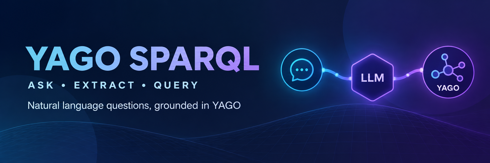

<p align="center">
  
</p>

<h1 align="center">YAGO LLM-to-SPARQL</h1>

<p align="center">
  <strong>Natural-language question answering grounded in the YAGO knowledge graph</strong>
</p>

<p align="center">
  
  
  
  
  
</p>

<p align="center">
  <a href="#quick-start">Quick start</a> ·
  <a href="#demo">Demo</a> ·
  <a href="#how-it-works">How it works</a> ·
  <a href="#supported-relationships">Relationships</a> ·
  <a href="#project-structure">Structure</a> ·
  <a href="#testing">Testing</a>
</p>

---

This project tests whether an LLM can interpret a factual question, extract its
entity and relationship, build a safe one-hop SPARQL query, and retrieve a
grounded answer from YAGO. Every intermediate result is visible, making failures
easy to trace.

## Demo

[▶ Watch the Streamlit demo](asset/demo.mp4)

The frontend shows the original question, structured LLM output, validation,
generated SPARQL, raw YAGO response, and extracted answers one step at a time.

## Quick start

### 1. Create an environment

```bash
python3 -m venv .venv
source .venv/bin/activate
python3 -m pip install -r requirements.txt
```

### 2. Configure the OpenAI API key

```bash
cp .env.example .env
```

Edit `.env`:

```dotenv
OPENAI_API_KEY=your_api_key_here
```

### 3. Start the frontend

```bash
streamlit run streamlit_app.py
```

Open [http://localhost:8501](http://localhost:8501), enter a question, and
select **Run pipeline**.

### Command-line pipeline

```bash
python3 -m core.pipeline
```

Change `user_question` at the bottom of `core/pipeline.py` to try another
question.

## How it works

```text
Natural-language question
        ↓
gpt-5-mini extracts structured information
        ↓
Validate entity, relationship, and predicate
        ↓
Build a fixed one-hop SPARQL query
        ↓
Execute against the public YAGO endpoint
        ↓
Extract and display grounded answers
```

### Example

Input:

```text
Where was Albert Einstein born?
```

Structured extraction:

```json
{
  "entity_name": "Albert Einstein",
  "entity_id": "Albert_Einstein",
  "relationship": "birth place",
  "predicate": "schema:birthPlace",
  "question_type": "place"
}
```

Generated query:

```sparql
PREFIX yago: <http://yago-knowledge.org/resource/>
PREFIX schema: <http://schema.org/>
PREFIX rdfs: <http://www.w3.org/2000/01/rdf-schema#>

SELECT ?answer ?answerLabel
WHERE {
  yago:Albert_Einstein schema:birthPlace ?answer .

  OPTIONAL {
    ?answer rdfs:label ?answerLabel .
    FILTER(LANG(?answerLabel) = "en")
  }
}
LIMIT 10
```

Answer:

```text
Ulm
```

## Supported relationships

The LLM must select from this allowlist and cannot introduce arbitrary
predicates.

| User intent | Predicate | Answer type |
| --- | --- | --- |
| Birth place | `schema:birthPlace` | Place |
| Birth date | `schema:birthDate` | Date |
| Death place | `schema:deathPlace` | Place |
| Director | `schema:director` | Person |
| Author | `schema:author` | Person |

## Pipeline stages

1. **Receive question** — accept one natural-language factual question.
2. **Extract information** — use `gpt-5-mini` Structured Outputs to identify the entity and relationship.
3. **Validate extraction** — enforce required fields, safe identifiers, and predicate mappings.
4. **Build SPARQL** — insert validated values into a fixed query template with `LIMIT 10`.
5. **Query YAGO** — send a timed request to the public SPARQL endpoint.
6. **Extract answers** — prefer English labels, fall back to raw values, and remove duplicates.

The Streamlit page renders each stage in a separate status panel. Submitting a
new question clears the previous trace before starting again.

## Project structure

```text
yago-llm-sparql/
├── core/
│   ├── __init__.py
│   ├── llm_parser.py
│   ├── sparql_builder.py
│   ├── yago_client.py
│   └── pipeline.py
├── tests/
│   ├── test_llm_parser.py
│   ├── test_sparql_builder.py
│   ├── test_yago_client.py
│   └── test_pipeline.py
├── scripts/
│   ├── manual_sparql_test.py
│   └── manual_yago_test.py
├── asset/
│   ├── readme-banner.png
│   └── demo.mp4
├── streamlit_app.py
├── requirements.txt
├── .env.example
└── README.md
```

| Component | Responsibility |
| --- | --- |
| `core/llm_parser.py` | Extract and validate structured question data |
| `core/sparql_builder.py` | Build a query from allowlisted values |
| `core/yago_client.py` | Execute queries and extract answers |
| `core/pipeline.py` | Run and print the complete pipeline |
| `streamlit_app.py` | Present the step-by-step browser interface |
| `scripts/` | Run manual checks without the full application |
| `tests/` | Verify extraction, query building, execution, and orchestration |

## Testing

Run the complete automated suite:

```bash
python3 -m unittest discover -s tests -v
```

Run the manual query-building and live YAGO checks:

```bash
python3 -m scripts.manual_sparql_test
python3 -m scripts.manual_yago_test
```

The manual YAGO test does not call the LLM and does not require an OpenAI API
key.

## V1 scope

V1 intentionally supports:

- One question, main entity, and relationship at a time
- One-hop SPARQL queries
- A small predicate allowlist
- A fixed, application-controlled query template
- Raw YAGO results plus lightweight answer extraction

V1 does not include Neo4j, graph embeddings, vector search, document RAG,
two-hop reasoning, autonomous agents, or conversational memory.

## Evaluation

The recommended evaluation set contains 20–30 questions with expected entity
identifiers, predicates, and answers. Measure these stages separately:

1. Entity extraction accuracy
2. Relationship extraction accuracy
3. Valid-query rate
4. Execution success rate
5. Result success rate

Separating the metrics distinguishes extraction mistakes from valid queries
that return no data in YAGO.

## Future work

- Resolve entities through YAGO label search instead of constructing identifiers
- Handle ambiguous names such as Mercury or Java
- Add targeted two-hop queries
- Generate grounded natural-language answers from retrieved triples
- Add persistent experiment logs and evaluation reports

## References

- [YAGO](https://yago-knowledge.org/)
- [YAGO SPARQL interface](https://yago-knowledge.org/sparql)
- [YAGO schema](https://yago-knowledge.org/schema)
- [SPARQL 1.1 Query Language](https://www.w3.org/TR/sparql11-query/)
